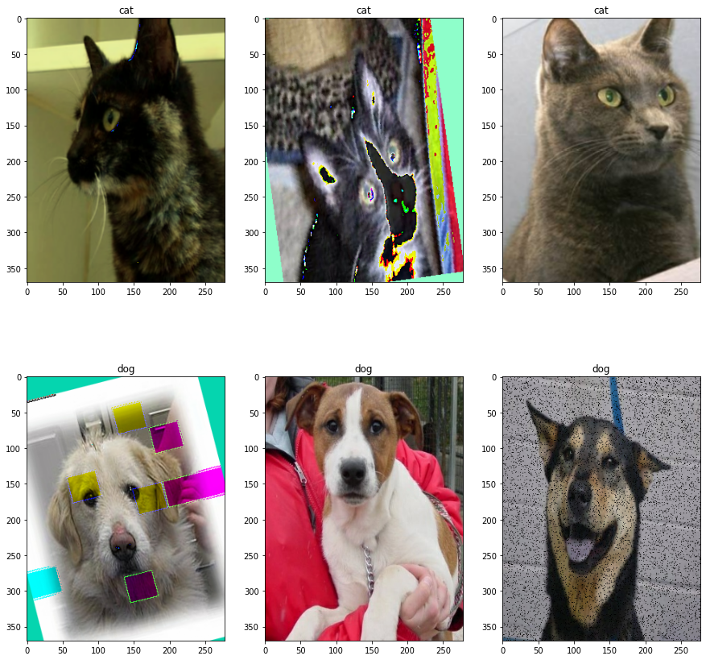

# Tensorflow-2 examples
* Creating datasets
    * creating TFRecord files
    * read on fly
* Image augmentation with imgaug and tf-2 dataset

```
ds = ds.map(_parse_function).map(tf_random_augmentations).map(normalize_image).batch(3)
rows, cols = 2, 3
fig, axs = plt.subplots(rows, cols, figsize=(15,15))
for i, (images, names) in enumerate(ds):
    for j, (image, name) in enumerate(zip(images, names)):
        image = image.numpy()
        name = name.numpy().decode("utf-8")
        axs[i,j].imshow(image)
        axs[i,j].set_title(name)
plt.show()
```


